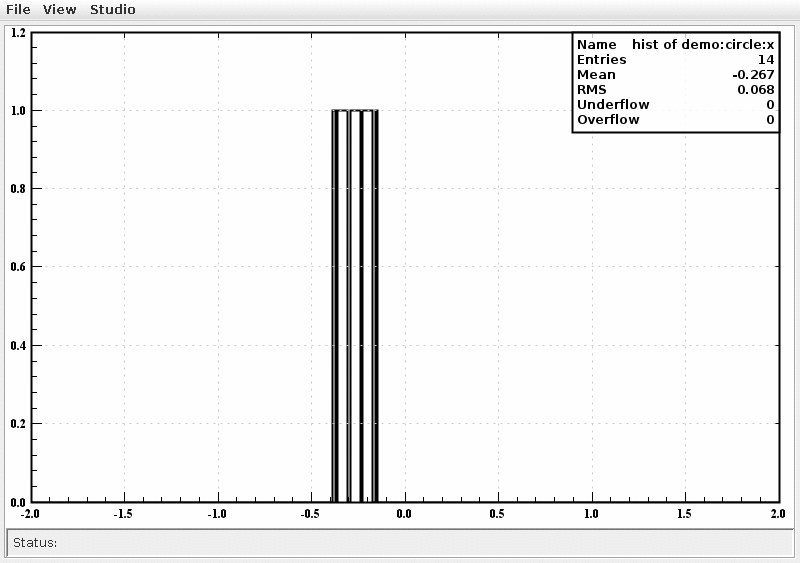
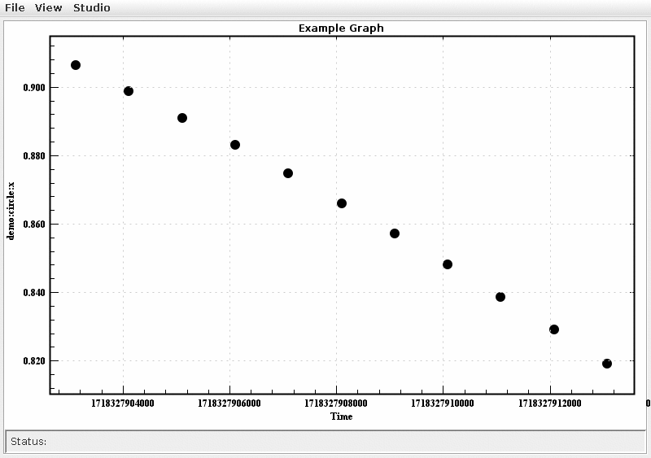

# EPICS Analysis Tools

## Goal

Add scripting and analysis tools as an independent app to Phoebus

**Steps:**
- Connect Java pvAccess client to a suitable java plotting/analysis library 
- Use Groovy for scripting 
- Connect to Eclipse for runtime analysis using Groovy
- Integrate in Phoebus as an independent app

**Summary: EPICS Analysis Tools = pva client + Java plotting/analysis libs + Groovy + Eclipse**

## Java plotting/analysis library options
- jas4pp: [jas4pp paper](https://arxiv.org/abs/2011.05329). Go to the [home page for jas4pp](https://atlaswww.hep.anl.gov/asc/jas4pp/) for details.
- [https://jfxtras.org/](https://jfxtras.org/) ---> Do Not Use
- [Groot](https://github.com/gavalian/groot) ----> **Use this for now**
- [JFreeChart](https://www.jfree.org/index.html)
- [DataMelt](https://datamelt.org/)

## Prepare Java plotting library: `groot`

- Clone/download the repository for [this](https://github.com/gavalian/groot) repository.
- Source your environment to activate JDK > 18 if you do not have it already.
- Generate jar package: `mvn package`
- Generate the documentation (for your reference) using the shell script provided. 
- Save the jar with dependencies and add them to your `CLASSPATH`.

## Prepare pvAccess Java client

- If you have a local copy of Pheobus, add the following path to your `CLASSPATH`: `<phoebus build>/target/lib/`. Instead of the whole thing, you could just clone only the Phoebus core from [here](https://github.com/ControlSystemStudio/phoebus/tree/master/core) and make a jar file of the Phoebus core framework and then place it under the `CLASSPATH`.
- Try to compile and run [this](https://github.com/ControlSystemStudio/phoebus/blob/master/core/pv-pva/src/test/java/org/phoebus/pv/pva/PVACustomStructDemo.java) example after changing the PV name.

 
## Running EPICS Analysis

- Once, both pva client (from Phoebus) and plotting library (from groot) jar files are under your `CLASSPATH`, you should be able to explore/run the examples posted under `src/`.
- The examples posted assume that a demo IOC is already running in the background.

## Demo

- The following histogram is from the example analysis `GrootPvaHist.java`. It show live histogramming of the PV `demo:circle:x`. The stat box on the top right shows the number of events, mean and sigma(RMS) of the signal. 

- The following graph is generated using the example `GrootPvaDemo.java`. This graph is analogous to the strip chart. However, it is possible to add more complex analysis (fitting, transformation etc) using the script on the fly.  

## To Do

- Implement separate Java package for the epics analysis tools.
- Allow scripting using Groovy
